# ME 405 Term Project

## Authors
Jack Krammer and Jason Chang

Assisting professors: 
* Ridgely, John R.
* Refvem, Charlie Thomas

California Polytechnic State University

March 18, 2024

## Description
Making a heat-sensing nerf turret. TODO


## Dependencies
essentially want to say that needs the micropython environment and 
to `import pyb` and 'import machine'
'''
code block?
'''
```
now code block
```
TODO

## Hardware Design
This section identifies key components in the hardware design 
of this project.

### Materials
The materials used to build this project.

#### Micropython Board and Electronics:
* 1x l6206 Motor Driver "Shield"
* 1x STM32L476RG Nucleo Arduino
* 1x The Shoe of Brian
* 1x Small Breadboard
* 1x Button
* 1x 0.1 uf Hilitchi Chip Capacitor
* 1x 0.33 uf Hilitchi Chip Capacitor
* 1x Voltage Regulator

#### Pre-fabricated Components:
* 1x Fortnite Nerf Flare Dart Blaster
* 1x Ametek-Pittman PG6712A077-R3 6665 DC Encoder Motor
* 1x 1501MG RC Servo Motor
* 1x 96 teeth 0.5 Module Gear
* 1x 6 in x 6 in Lazy Susan Hardware
* 1x 1 ft Long Shoe String
* 6x Stainless Steel Pan Head Slotted M3 x 25 mm Long x 0.5 mm 
Pitch Screws
* 2x Stainless Steel Female Threaded Hex M3 x 8 mm Long x 0.5 mm 
Pitch Standoffs
* 4x Zinc Plated #8 x 1/2 in Machine Bolts
* 4x #8 Hex Nuts
* 3x Stainless Steel Pan Head Slotted M4 x 12 mm Long x 0.7 mm 
Pitch Screws
* 3x Stainless Steel Hex M4 x 0.7 mm Pitch Nuts


### CAD Model Description:
This section the idea behind the design of the main body and 
associated components.


<div align='center'>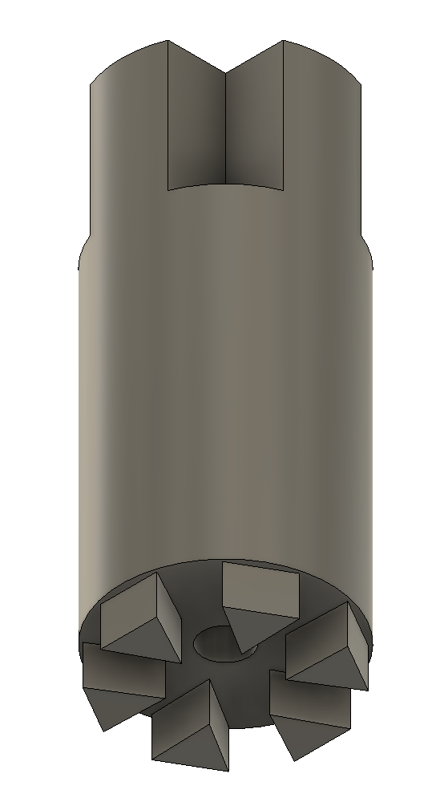

Figure 1. When designing the Foam Dart Blaster Turret we centralized 
it around its main axle of rotaion. This rotation would be from the 
96 teeth gear. To support this design, the central shaft was 
designed to connect to the 6 inner gaps, as seen below.


<!-- 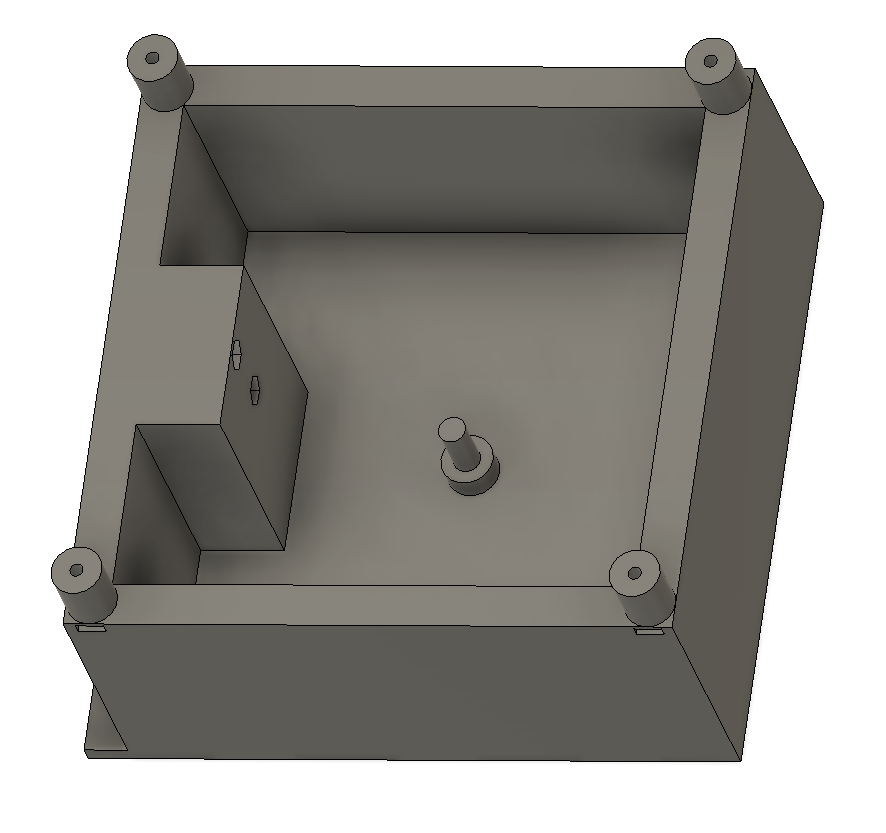 -->


Figure 4. In order to power the 96 teeth gear, it needed to connect 
to the chosen motor of this project: the Ametek-Pittman DC Encoder 
Motor. The motor drives a 16 teeth gear that is the same module 
number as the 96 teeth gear. To ensure constant contact between 
these two gears, the required distance between the two was kept in 
mind when designing the bottom frame of the Foam Dart Blaster Turret. 

<div align='left'>
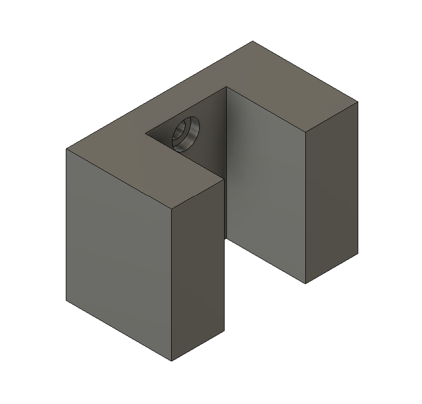

Figure 5. The bottom frame also accounted for the distance gained from 
the motor holder component.


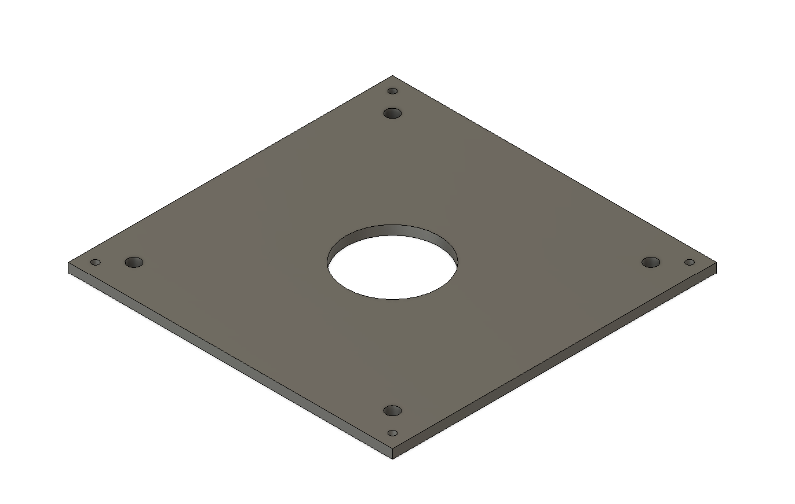

Figure 6. In order to prevent the 96 teeth gear from experiencing any 
excessive friction, a lazy susan was incorporated into the design. This 
meant that the majority of the vertical weight from the rotating portion 
of the Foam Dart Blaster Turret could be displaced into the walls of the 
bottom frame instead. To secure the lazy susan to the bottom frame, a 
plate was made to connect the two components together. 


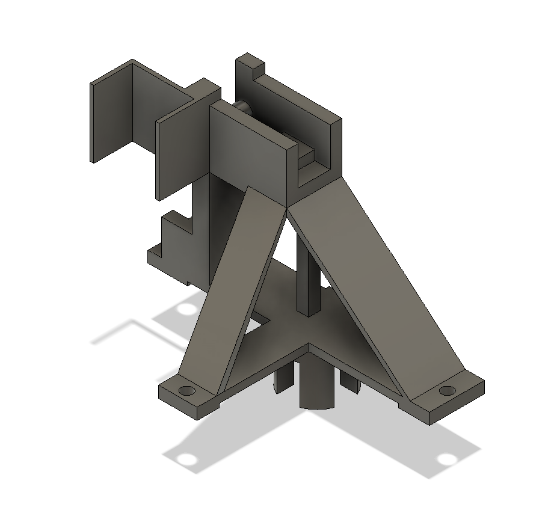

Figure 7. The main turret was designed to connect to two components; the 
lazy susan and the central shaft. This way it would recieve the torque 
from the shaft and displace its weight into the frame. Alongside 
connecting to those components, the main turret was designed to hold the 
chosen Foam Dart Blaster (Fortnite Nerf Flare Dart Blaster) and a servo 
motor near the trigger of the Nerf Gun to allow control over when it would 
shoot.


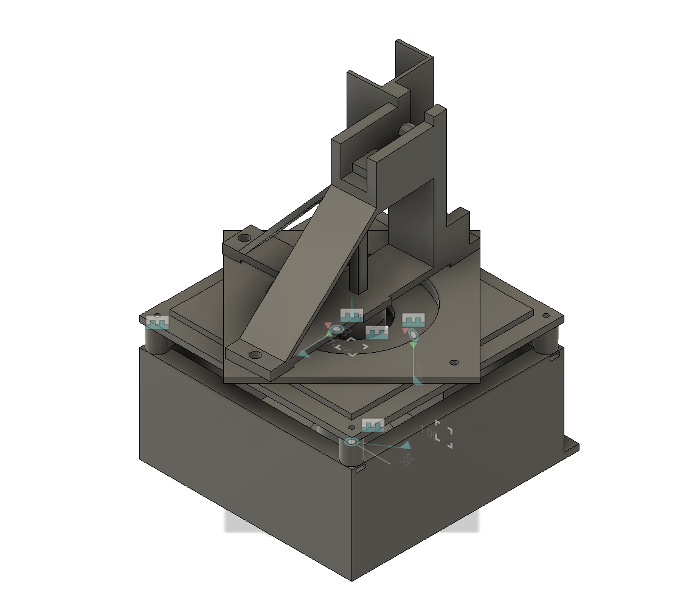

Figure 8. Below is the full CAD assembly of the Foam Dart Blaster Turret 
from the previusly mentioned components. 


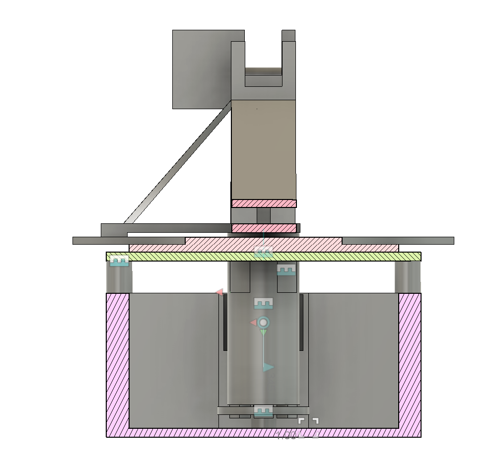

Figure 9. To understand how the Foam Dart Blaster Turret better works, it 
can be viewed at two section analysis views. In this first one below, the 
main turret can be seen being connected to the central shaft and the central 
shaft being connected to the 96 teeth gear (of which is represented by a 
simplified model in the assembly). 


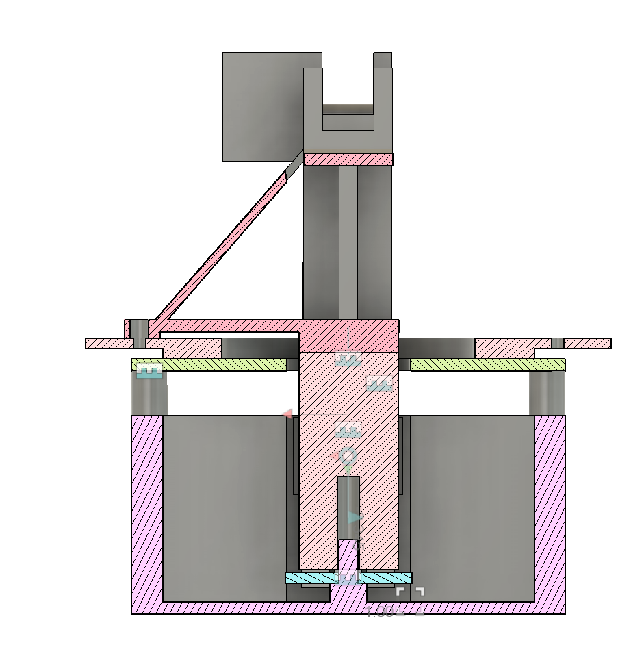

Figure 10. In this next section analysis view, a clearer image of how the 
central shaft operates is shown. While the 96 teeth gear rotates around 
the bottom frame shaft, the torque it generates is transferred upward to 
the main turret through the mediated connection with the central shaft. 
Also seen is the small gab between the central shaft and the 96 teeth gear. 
This shows that if fitted properly, no downward force will be place onto 
the 96 teeth gear (other than its own weight), preventing any excessive 
friction at that point. 


### Electrical Schematics

schematics. TODO


### Assembly Issues:
Once the CAD models were 3D printed, assembly began. However, a series of 
problems became apparent. 


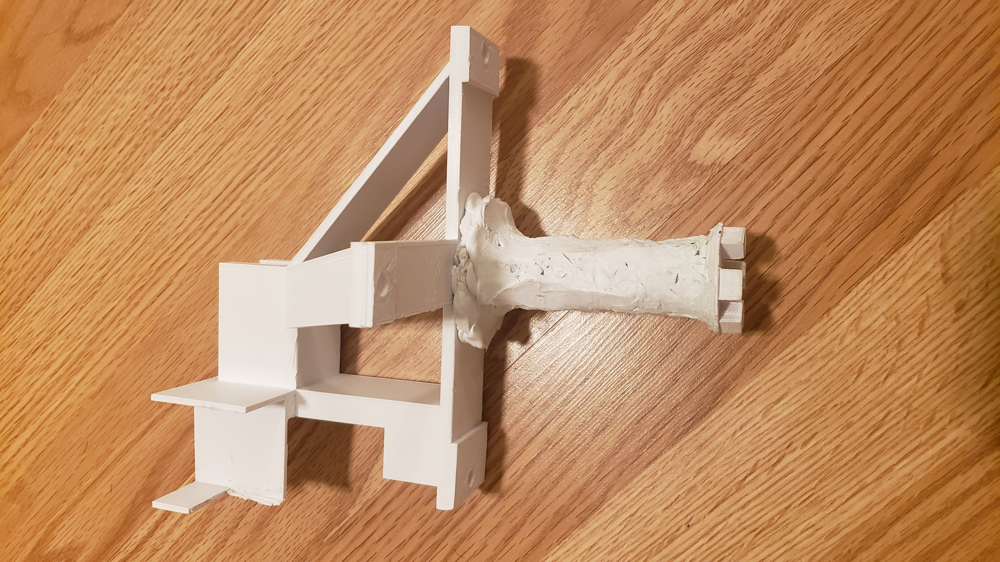

Figure 9. Firstly, the central shaft was too thick as the size of the DC 
motor was not taken into account when modeling. Due to lack of time to 
print an updated design, the central shaft (and connected main turret 
shaft portion) were sanded down in Mustang60 using a vetical belt wood 
sander. However, due to the heat from sanding, the plastic of the 3D 
print began to melt. So instead of simply grinding down the plastic, the 
melted layer of plastic was pushed to the ends of the shaft (mostly 
towards the main turret end). This provided a small benefit in fusing the 
central shaft to the main turret together. In the end, the central shaft 
was able to be "sanded" down in size to allow clearance for the DC motor.


Figure 10. Secondly, the portion of the main turret that housed the servo 
motor had walls that were too long. Specifically, the servo motor could not 
fit in due to there being no room for the wires to pass through. To remedy 
this, the back wall was cut down in size.


### Electromechanical Properties

| Motor Parameter | Value | Unit | 
|:---------------:|:-----:|:----:|
| Total Rotating Mass | 0.407 | $kg$ |
| Length to Center of Gravity | 0.050 | $m$ |
| Mass Moment of Inertia | 1.125e-3 | $I$ |
| Viscous Damping Coefficient | 3.14e-7 | $b$ |
| Torque Constant | 0.0282 | $K_t$ |
| Back-emf Constant | 0.0282 | $K_v$ |
| Terminal Resistance | 35.0 | $\Omega$ |
| Terminal Inductance | 1.00e-5$*$| $H$ | 
| Motor DC Voltage | 12 | $V$ |

Table 1. Characteristics of the motor used in our project.

* Length to Center of Gravity is measured from the origin of 
the axis of rotation to the center of gravity.
* Assumed a near zero inductance due to the insignificance 
of the inductance to the load on the turret motor.


### Completed Design
These next images illustrate the final product in action.

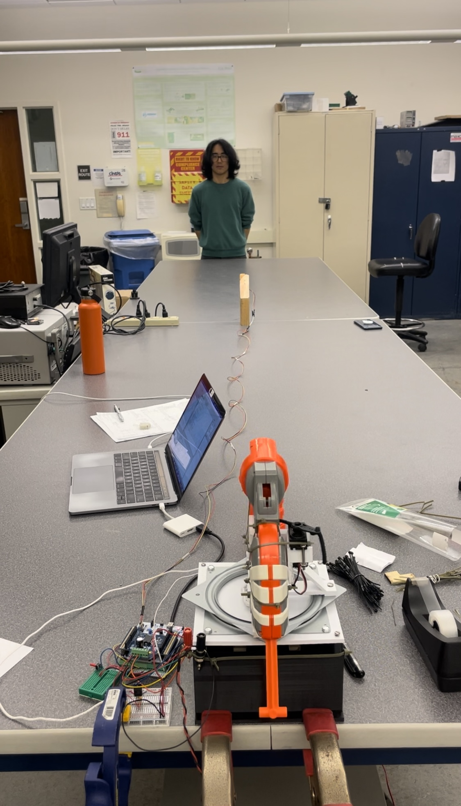

Figure 1. Back view of the final design in action. 


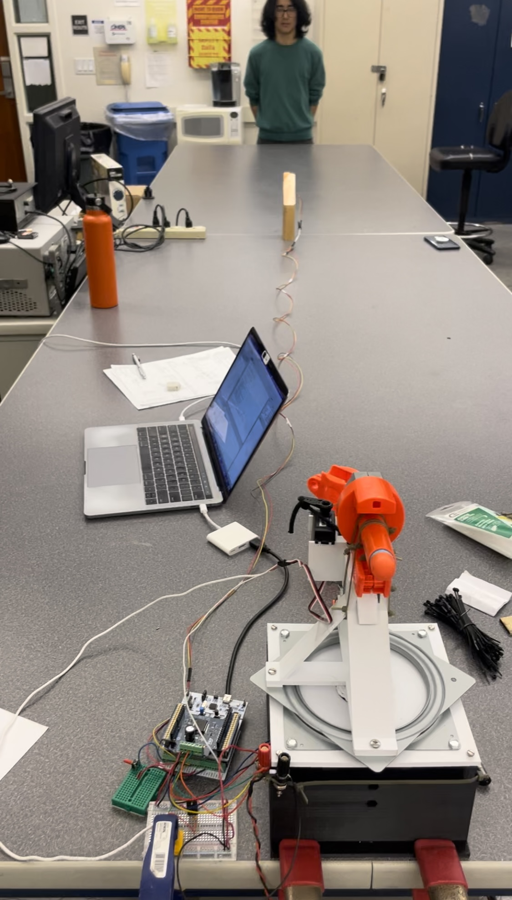

Figure 2. Front view of the final design in action. 


## Software Design

Overview of software design. TODO
[Link to Doxygen pages and documentation](google.com)


## Discussion of Results

discuss. TODO


## Discussion of Learnings and Recommentations 

discuss. TODO


## License 
copyright (c) 2024 by mecha04 and released under MIT License

