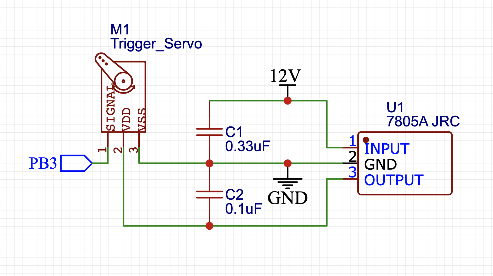

# ME 405 Term Project

## Authors
Jack Krammer and Jason Chang

Assisting professors: 
* Ridgely, John R.
* Refvem, Charlie Thomas

California Polytechnic State University

March 18, 2024

## Description
For the Winter Quarter term of ME 405's lab, we were assigned by Dr. John Ridgely 
to create a **heat-sensing foam dart blaster turret**. Its capabilites include full 
autonomous motion, aiming, and firing. For aiming it would use a lab provided 
thermal infrared camera (model MLX90640) to find its intended target.

Our device was tested against others on Dueling Day where along the ends of a long 
table each opposing device was secured and a single member of each team stood behind 
their respective device. Upon the "duel" beginning, members would move within a 5 
second period, where afterwards they must remain frozen in their chosen position and 
each oppposing device must aim and fire against their opponent within 10 seconds 
afterwards. For further clarification upon project and Dueling Day rules, you may go 
to Dr. John Ridgely's provided HTML file below.
<a href="./src/links/termproj_W24.html" title="term_proj_specs">Term Project Specifications</a>

## Dependencies
This project depends on the MicroPython 
<a href="https://docs.micropython.org/en/latest/library/pyb.html" title="pyb">pyb</a>,
<a href="https://docs.micropython.org/en/latest/library/machine.I2C.html" title="machine I2C">machine.I2C</a>,
<a href="https://docs.micropython.org/en/v1.15/library/utime.html" title="uitme">utime</a>,
<a href="https://docs.python.org/3/library/math.html" title="math">math</a>,
and 
<a href="https://docs.python.org/3/library/gc.html" title="gc">gc</a>
libraries as well as 
<a href="https://github.com/spluttflob/ME405-Support/tree/main/mlx_raw" title="mlx_cam">mlx_cam</a>
and 
<a href="https://github.com/spluttflob/ME405-Support/blob/main/src/cotask.py" title="cotask">cotask</a>
with some associated documentation found 
<a href="https://spluttflob.github.io/ME405-Support/" title="ME 405 documentatin">here</a>.

More documenation and diagrams describing the software for this project can be found
<a href="https://8red10.github.io/ME_405_Term_Project/" title="project documentation">here</a>.

## Hardware Design
This section identifies key components in the hardware design of this project.

### Materials
The materials used to build this project.

#### Micropython Board and Electronics
* 1x L6206 Motor Driver "Shield"
* 1x STM32L476RG Nucleo Arduino
* 1x The Shoe of Brian
* 1x Small Breadboard
* 1x Button
* 1x 0.1 uf Hilitchi Chip Capacitor
* 1x 0.33 uf Hilitchi Chip Capacitor
* 1x 7805A JRC Voltage Regulator

#### Pre-fabricated Components
* 1x Fortnite Nerf Flare Dart Blaster
* 1x Ametek-Pittman PG6712A077-R3 6665 DC Encoder Motor
* 1x 1501MG RC Servo Motor
* 1x 96 teeth 0.5 Module Gear
* 1x 6 in x 6 in Lazy Susan Hardware
* 1x 1 ft Long Shoe String
* 6x Stainless Steel Pan Head Slotted M3 x 25 mm Long x 0.5 mm Pitch Screws
* 2x Stainless Steel Female Threaded Hex M3 x 8 mm Long x 0.5 mm Pitch Standoffs
* 4x Zinc Plated #8 x 1/2 in Machine Bolts
* 4x #8 Hex Nuts
* 3x Stainless Steel Pan Head Slotted M4 x 12 mm Long x 0.7 mm Pitch Screws
* 3x Stainless Steel Hex M4 x 0.7 mm Pitch Nuts

### CAD Model Description
This section the idea behind the design of the main body and associated components.

**Figure 1.** When designing the Foam Dart Blaster Turret we centralized it around 
its main axle of rotaion. This rotation would be from the 96 teeth gear. To support 
this design, the central shaft was designed to connect to the 6 inner gaps, as seen 
above.

	
**Figure 2.** In order to power the 96 teeth gear, it needed to connect to the 
chosen motor of this project: the Ametek-Pittman DC Encoder Motor. The motor drives 
a 16 teeth gear that is the same module number as the 96 teeth gear. To ensure 
constant contact between these two gears, the required distance between the two was 
kept in mind when designing the bottom frame of the Foam Dart Blaster Turret. 

**Figure 3.** The bottom frame also accounted for the distance gained from the motor 
holder component.

**Figure 4.** In order to prevent the 96 teeth gear from experiencing any excessive 
friction, a lazy susan was incorporated into the design. This meant that the majority 
of the vertical weight from the rotating portion of the Foam Dart Blaster Turret could 
be displaced into the walls of the bottom frame instead. To secure the lazy susan to 
the bottom frame, a plate was made to connect the two components together. 

**Figure 5.** The main turret was designed to connect to two components; the lazy susan 
and the central shaft. This way it would recieve the torque from the shaft and displace 
its weight into the frame. Alongside connecting to those components, the main turret was 
designed to hold the chosen Foam Dart Blaster (Fortnite Nerf Flare Dart Blaster) and a 
servo motor near the trigger of the Nerf Gun to allow control over when it would shoot.

**Figure 6.** Above is the full CAD assembly of the Foam Dart Blaster Turret from the 
previusly mentioned components. 

**Figure 7.** To understand how the Foam Dart Blaster Turret better works, it can be viewed 
at two section analysis views. In this first one above, the main turret can be seen being 
connected to the central shaft and the central shaft being connected to the 96 teeth gear 
(of which is represented by a simplified model in the assembly). 

**Figure 8.** In this next section analysis view, a clearer image of how the central shaft 
operates is shown. While the 96 teeth gear rotates around the bottom frame shaft, the 
torque it generates is transferred upward to the main turret through the mediated 
connection with the central shaft. Also seen is the small gab between the central shaft 
and the 96 teeth gear. This shows that if fitted properly, no downward force will be 
place onto the 96 teeth gear (other than its own weight), preventing any excessive friction 
at that point. 

## Electronics Design
This section illustrates some of the key custom electronic designs used for this 
project.

### Start Button

**Figure 9.** This illustrates the schematic of the active low button with a pull up 
resistor. The PC2 tag identifies the pin input to the microcontroller.

**Figure 10.** For the button we used to trigger the start our device's autonamous 
actions, we used a pull-up resistor set up so that upon button press it would produce 
a low signal to our chosen pin input. From this low signal, we are able to code within 
the micro-controller based around it. The pin we chose to take the button circuitry's 
input was pin PC2.

### Emergency Stop Component

**Figure 11.** For the emergency stop we used a red wire that was responsible for 
supplying power to the motors of our project. To connect this red wire to the power 
cable, we used two terminal screws that were secured to our device via zip ties. 

### Voltage Regulator for Servo Input

**Figure 12.** This illustrates the schematic of the voltage regulator that converts 
the 12V DC supply for the motor down to a managable 6V for the servo's VDD. The PB3
tag identifies the pin output from the microcontroller to the servo signal wire. A
7805A JRC transistor was used to facilitate most of the voltage regulation.

**Figure 13.** In order to supply the correct amount of voltage to our servo motor 
(5-6 V), we used a voltage regulator to reduce our source voltage of 12 V to 5.5 V to 
our servo motor. By following the manuel and connecting two capacitors to its terminal 
ends, we were able to supply our servo motor the proper amount of voltage. 

## Software Design
The software running the turret was designed to multitask using a task scheduler
to more efficiently run the turret. The button task monitors the button and waits 
the appropriate 5 seconds before signaling the image task and rotate task to start.
The image task gets a thermal image from the camera and parses the image data 
into a setpoint to send to the rotate task. The rotate task rotates the turret
towards the identified target and fires the turret by actuating the servo. More
information and software documentation can be found 
<a href="https://8red10.github.io/ME_405_Term_Project/" title="project documentation">here</a>.

